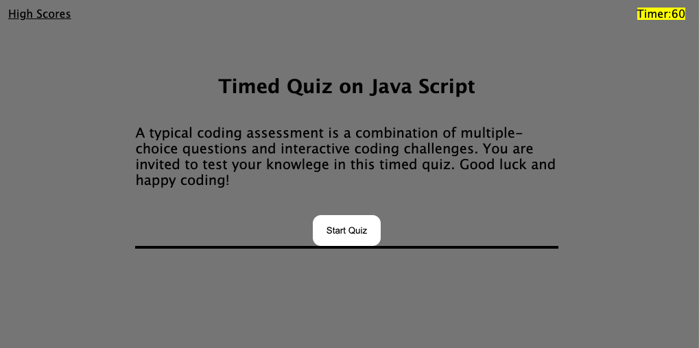
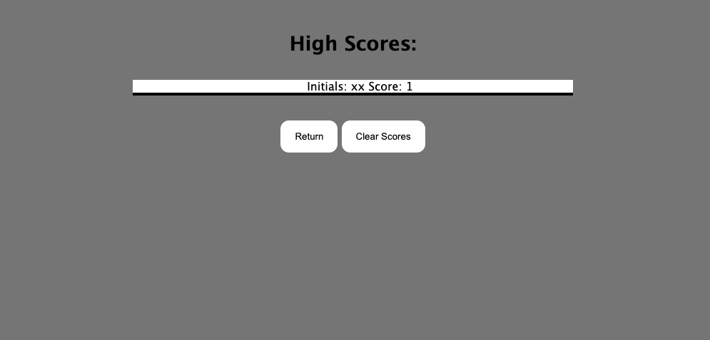

# timed-quiz

https://cleanjenn.github.io/timed-quiz/

## Capture 



## User Story
```text
For coding bootcamp students: 
Keep your knowdlege fresh by taking a timed quiz on Java Script fundamentals that get stored by your high scores. This allows you to keep track of your progress throughout your attemps. 

This quiz is runned by HTML, JS, CSS viewable on most internet programs.
```

## Acceptance Critera
```text
GIVEN I am taking a code quiz
WHEN I click the start button
THEN a timer starts and I am presented with a question
WHEN I answer a question
THEN I am presented with another question
WHEN I answer a question incorrectly
THEN time is subtracted from the clock
WHEN all questions are answered or the timer reaches 0
THEN the game is over
WHEN the game is over
THEN I can save my initials and score
```
